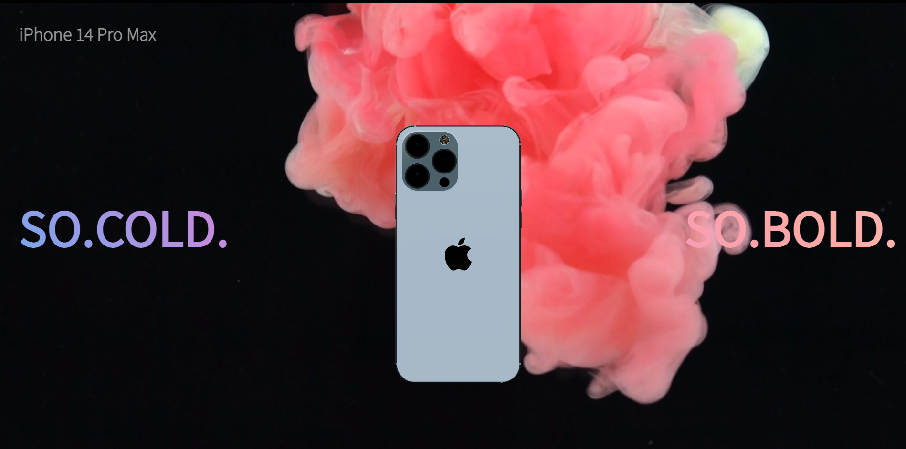
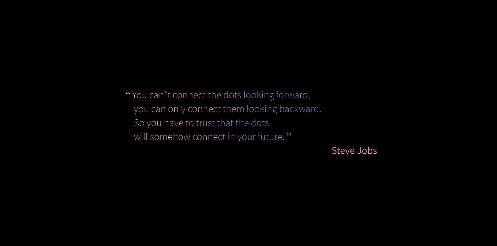
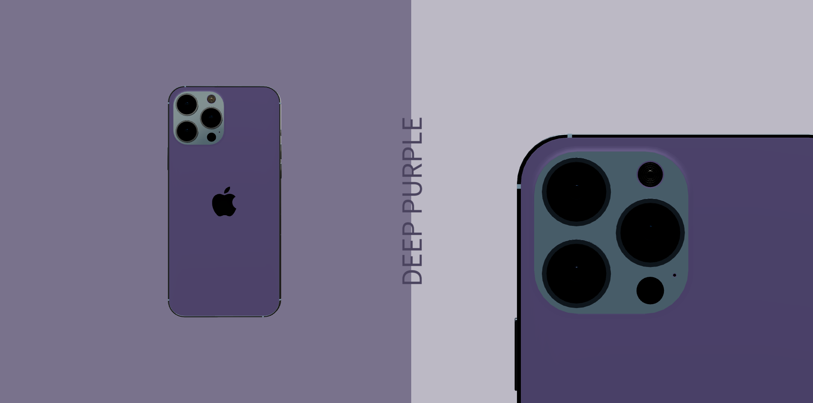
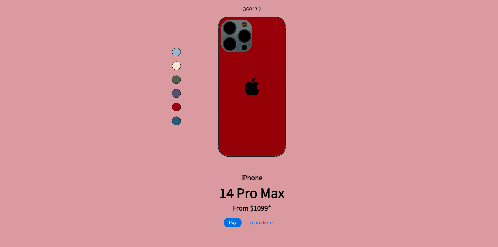
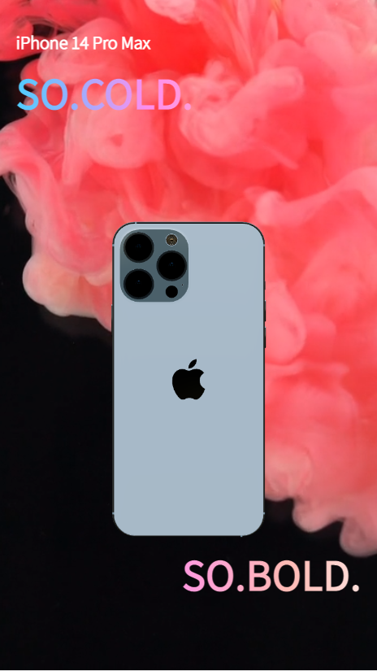
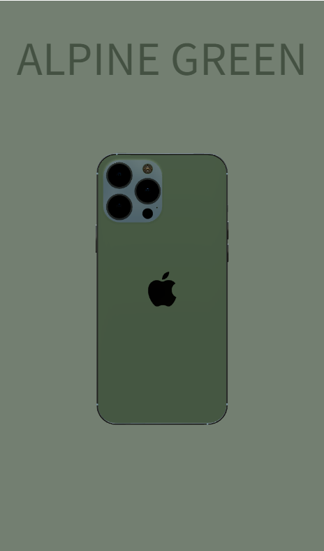
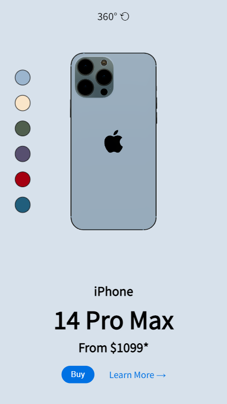

# Apple iPhone 3d landing page in ReactJS, ThreeJs & GSAP

~ Prince Chhirolya - [LinkedIn](https://www.likedin.com/in/princechhirolya/)

### Images of The 3d landing page Website:

### Resources Used in This Project

- ["Apple iPhone 13 Pro Max"](https://skfb.ly/o7nDN) by DatSketch is licensed under [Creative Commons Attribution](http://creativecommons.org/licenses/by/4.0/).  

- [A15 Chipset Image](https://wccftech.com/a15-bionic-underclocked-cpu-new-gpu-configurations-and-more-details-not-shared/)  

- [Apple Logo for loading screen](https://www.iconfinder.com/icons/104447/apple_logo_icon)

### External Libraries used in this project:

- [styled-components](https://styled-components.com/docs/advanced)  
- [GSAP](https://greensock.com/gsap/)  
- [@react-three/drei](https://www.npmjs.com/package/@react-three/drei)  
- [@react-three/fiber](https://www.npmjs.com/package/@react-three/fiber)  

